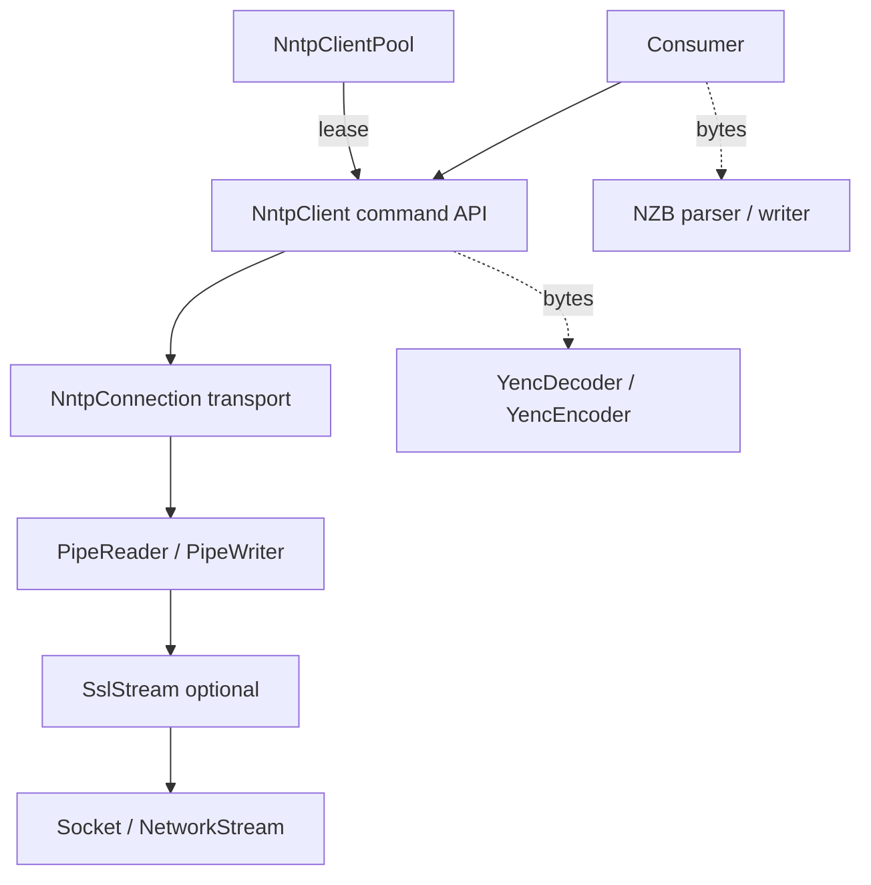
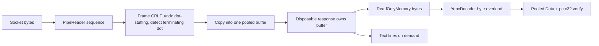
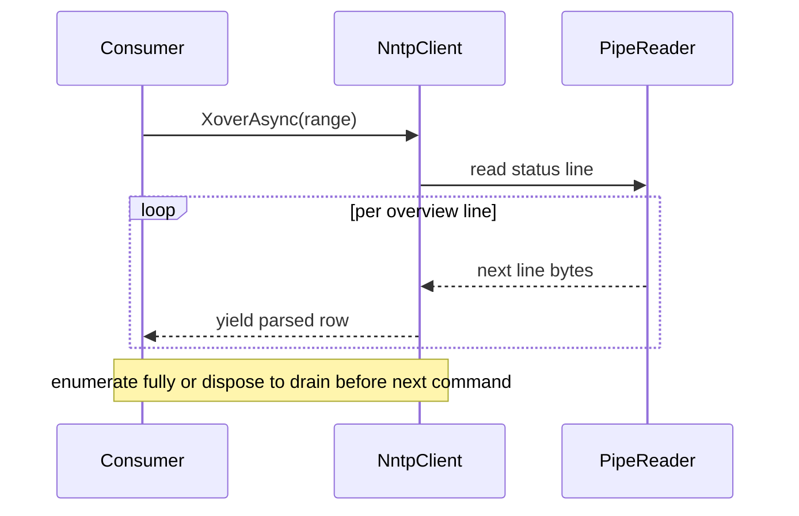
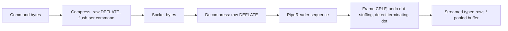
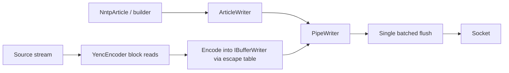
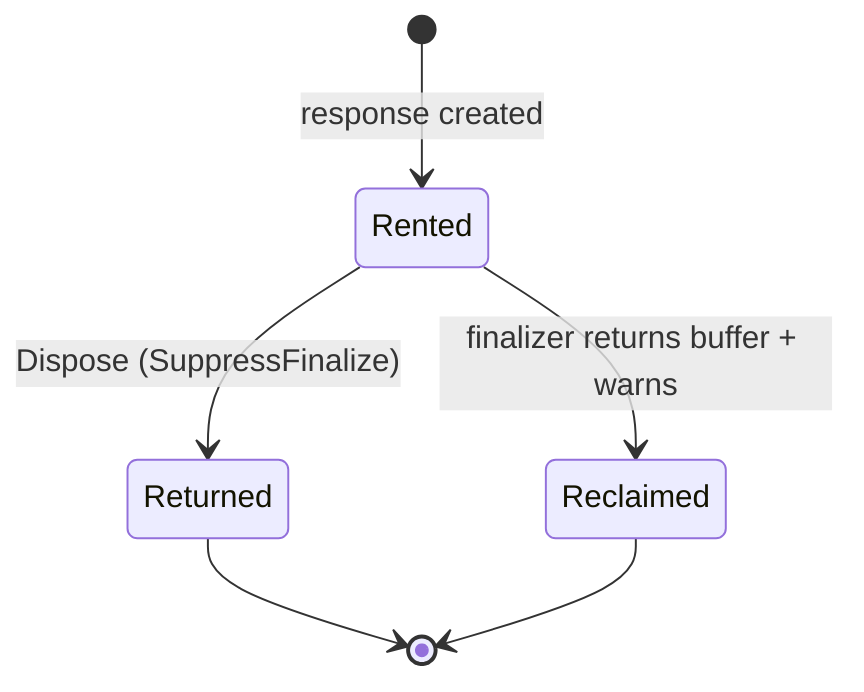

# Architecture

Target architecture for the 6.0.0 performance and memory rebuild. See the ADRs for the
reasoning behind each decision:

- [ADR-0001](adr/0001-article-buffering-and-streaming-model.md): buffer each part whole
- [ADR-0002](adr/0002-byte-oriented-article-bodies.md): byte-oriented bodies, pooled and caller-owned
- [ADR-0003](adr/0003-streaming-multiline-responses.md): streamed multi-line responses (+ typed `OVER` and bounded commands)
- [ADR-0004](adr/0004-cancellation-and-de-overloaded-command-api.md): optional cancellation tokens, de-overloaded command API
- [ADR-0005](adr/0005-compressed-overview-transport-and-connection-options.md): compressed overview transport, consolidated connection options

## Layering

- **Connection**: transport. Owns the socket, the optional `SslStream`, and the
  `PipeReader`/`PipeWriter`. Frames lines, undoes dot-stuffing, counts bytes.
- **Client**: command API (the RFC methods) built on a connection.
- **Pool**: manager of authenticated, connected clients reused across operations.
- **Lease**: a client borrowed from the pool for one operation, returned on dispose.
- **yEnc** and **NZB** are independent layers. The client hands over bytes and never
  decodes; consumers invoke yEnc/NZB explicitly.

## Read path (article body)

- Bytes are framed by the `PipeReader`, never transcoded to `string` on the wire.
- One article (one yEnc part, bounded around 1 MB) is copied into a single pooled buffer.
- The response is disposable and owns that buffer. Views are valid until disposal.
- Binary consumers decode bytes into pooled Data and verify the per-part `pcrc32`.
- Text and XML consumers read bytes directly or ask for lines on demand.

## Bulk read path (OVER/XOVER, HDR/XHDR, LISTGROUP, NEWNEWS)

- Unbounded results stream as `IAsyncEnumerable<T>` of library-parsed **typed rows**
  (`OVER`/`XOVER` → `NntpArticleOverview`, `HDR`/`XHDR` → `NntpHeaderField`, etc.), parsed per
  line as they arrive. The consumer never supplies a parser for the standard commands. Malformed
  rows are skipped.
- The by-message-id forms (`OverByMessageIdAsync`, `HdrByMessageIdAsync`, `XhdrByMessageIdAsync`)
  address a single article, so they materialize that one record and return `NntpArticleOverview?` /
  `NntpHeaderField?` directly — no stream, no drain contract.
- Memory stays flat regardless of range size; the consumer starts on the first row.
- Drain contract: enumerate fully, or dispose the enumerator, before the next command on
  that lease. On early-exit the connection is reclaimed by draining while a small budget
  remains (64 KB) and otherwise abandoned so the pool reconnects, keeping `break` cheap over
  large ranges. The pooled lease discards a still-pending enumerator on return.

## Compressed transport (COMPRESS DEFLATE, RFC 8054)

- Compression is a **transparent connection mode**, not a command. It is configured as an
  `NntpCompression` value on `NntpConnectionOptions` and negotiated as the third step of the
  session-setup recipe (connect → authenticate → `COMPRESS DEFLATE`), because RFC 8054 §2.2 forbids
  authenticating once compression is active. The pool re-applies the whole recipe on every transparent
  reconnect, so a replaced connection is never left uncompressed while the transport expects a
  compressed stream.
- Negotiation is **optimistic and fail-fast**: the connection issues `COMPRESS DEFLATE` directly (no
  `CAPABILITIES` pre-check); `206`/`502`-already-active is success, anything else throws an
  `NntpException` rather than silently serving plaintext.
- Once the `206` CRLF is read the transport installs a **bidirectional raw-DEFLATE layer**: a
  decompressing `DeflateStream` feeds the line framer and a compressing `DeflateStream` wraps the
  command writer (flushed per command so the server can decode it incrementally). The layer is uniform
  and invisible — every command, overview and article alike, rides it with no per-command branching.
- Because RFC 8054 starts compression immediately after the `206` CRLF, a server may coalesce the
  status line and the first compressed bytes into one segment. Bytes the plaintext reader over-read
  past the status line are recovered and replayed through the decompressor ahead of the socket. Byte
  counting moves to decompressed (logical) bytes, since the framer sits above the layer.

## Compressed overview commands (XZVER/XZHDR, Highwinds-family)

- Highwinds-family servers (eweka and many resellers) do **not** advertise RFC 8054 `COMPRESS`, so
  `NntpCompression.Deflate` is unavailable against them and would throw at session setup. They instead
  offer the non-standard `XZVER`/`XZHDR` commands — compressed siblings of `XOVER`/`XHDR`. These are
  exposed as explicit `XzverAsync`/`CurrentXzverAsync`/`XzhdrAsync`/`CurrentXzhdrAsync` methods,
  selected by the consumer from the typed `NntpCapabilities`; there is no transparent upgrade of
  `XOVER`/`XHDR`.
- Unlike `COMPRESS DEFLATE`, this is **command selection, not a transport mode**: only the data block
  of that one command is compressed, the status line stays clear text, and no connection state is left
  for the pool to re-apply. The data block is a single compressed member with the `.` terminator
  *inside* it, so the existing framer and terminator detection apply unchanged to the inflated bytes.
- The decoder is chosen by **sniffing the data block's first byte** rather than trusting the
  `[COMPRESS=GZIP]` label (which is unreliable — eweka ships zlib despite it): `0x78` → `ZLibStream`,
  `0x1f` → `GZipStream`, otherwise a raw `DeflateStream`. The transport installs this per-command
  decompression scope after the status line, frames inflated lines off a `PipeReader` over it, and
  tears it down at the dot terminator so the next command reads plaintext again. `BytesRead` counts
  decompressed (logical) bytes. See [ADR-0006](adr/0006-xzver-xzhdr-zlib-overview-compression.md).

## Write path (encode and post)

- `YencEncoder` reads the source in blocks and encodes into an `IBufferWriter<byte>` using
  a precomputed escape table. No per-byte reads, no `List<string>` of all lines.
- The connection exposes that `IBufferWriter<byte>` as `Output` (a counting view over the
  `PipeWriter`), so the encoder streams yEnc bytes straight into the write buffer.
- `ArticleWriter` buffers headers (with folding) and body (with dot-stuffing) via
  `BufferLine`, then `FlushAsync` sends the whole command in one batched flush instead of a
  flush per line.
- `TCP_NODELAY` is enabled on the socket: with a single flush per command, the final
  sub-MSS segment would otherwise stall against the server's delayed ACK before the response
  could be read.

## Buffer lifetime

- Pooled buffers are rented from `ArrayPool` per in-flight article. Every public pooled
  owner (`NntpArticleResponse`, `YencPart`) shares one contract via an internal `PooledBuffer`
  helper: `IDisposable` + `IAsyncDisposable` and a finalizer safety net.
- `Body`/`Data` are handed out over a `MemoryManager<byte>` that is invalidated on dispose, so
  a view read after disposal — even a captured copy — throws rather than reading a recycled
  buffer.
- Correct disposal returns the buffer and suppresses the finalizer.
- A leaked (undisposed) owner is recovered by a finalizer that returns the buffer and raises a
  shared `PooledBufferDiagnostics.LeakedBufferCount`, so a forgotten `await using` cannot
  permanently starve the pool.

## Cross-cutting

- **Pooling, not caching.** Buffer reuse via `ArrayPool` and precomputed lookup tables.
  No response or article cache. Caching that term stays reserved for the connection Pool.
- **Byte counting** lives in the pipe layer. `BytesRead` / `BytesWritten` /
  `ResetCounters` stay on the client. The old public `CountingStream` is removed.
- **Logging** uses source-generated `LoggerMessage` and a DI-friendly `ILoggerFactory`
  injected via constructor, defaulting to `NullLoggerFactory`. No global static, and no DI
  container required for simple projects.
- **Target frameworks** stay `net8.0;net10.0`. Performance APIs used here exist on both.
