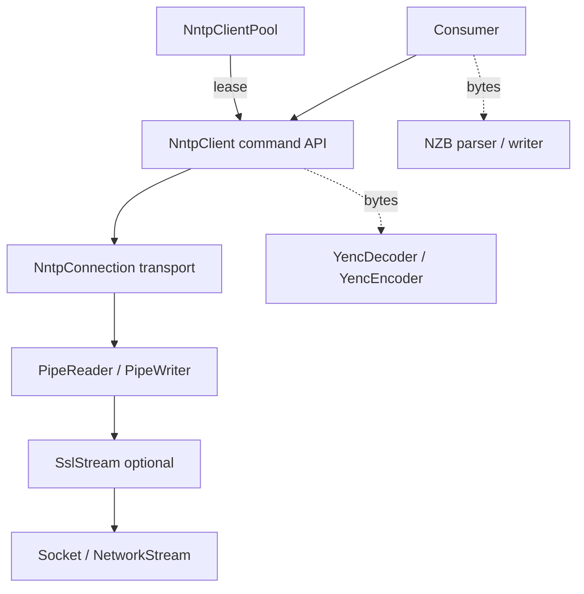
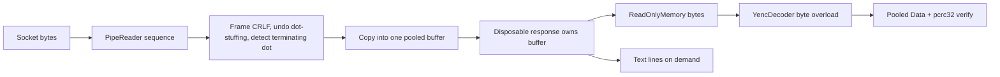
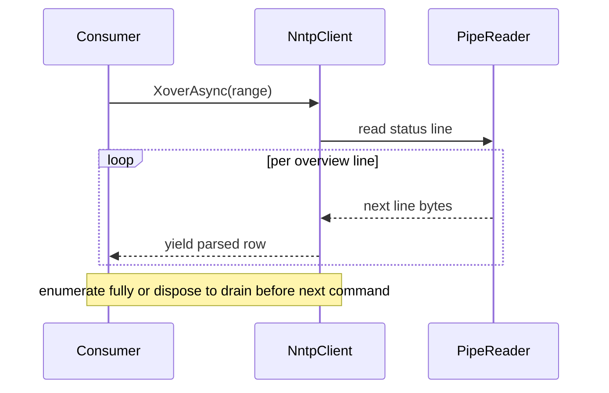
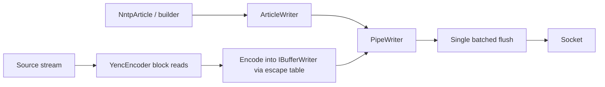
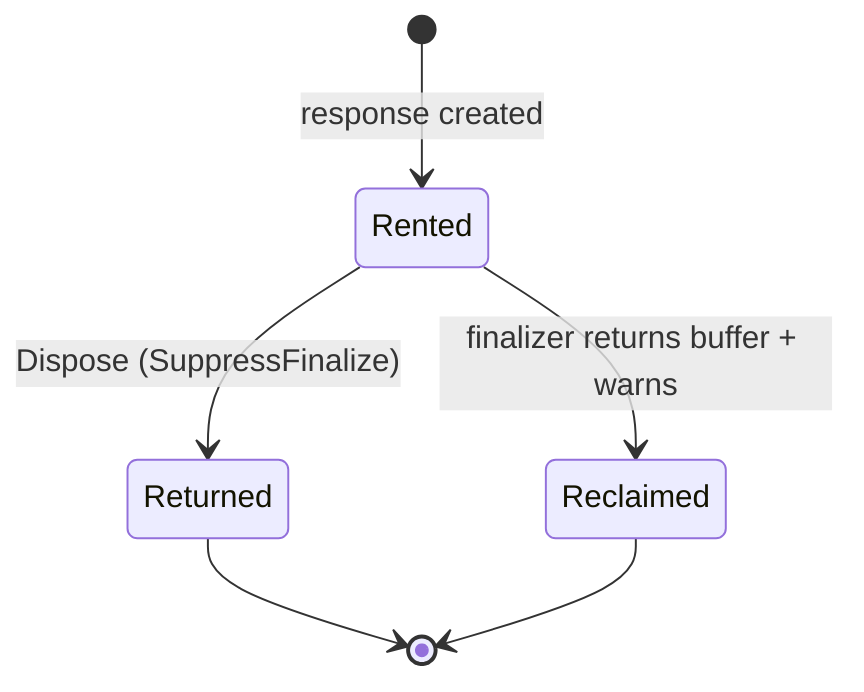

# Architecture

Target architecture for the 6.0.0 performance and memory rebuild. See the ADRs for the
reasoning behind each decision:

- [ADR-0001](adr/0001-article-buffering-and-streaming-model.md): buffer each part whole
- [ADR-0002](adr/0002-byte-oriented-article-bodies.md): byte-oriented bodies, pooled and caller-owned
- [ADR-0003](adr/0003-streaming-multiline-responses.md): streamed multi-line responses

## Layering

- **Connection**: transport. Owns the socket, the optional `SslStream`, and the
  `PipeReader`/`PipeWriter`. Frames lines, undoes dot-stuffing, counts bytes.
- **Client**: command API (the RFC methods) built on a connection.
- **Pool**: manager of authenticated, connected clients reused across operations.
- **Lease**: a client borrowed from the pool for one operation, returned on dispose.
- **yEnc** and **NZB** are independent layers. The client hands over bytes and never
  decodes; consumers invoke yEnc/NZB explicitly.

## Read path (article body)

- Bytes are framed by the `PipeReader`, never transcoded to `string` on the wire.
- One article (one yEnc part, bounded around 1 MB) is copied into a single pooled buffer.
- The response is disposable and owns that buffer. Views are valid until disposal.
- Binary consumers decode bytes into pooled Data and verify the per-part `pcrc32`.
- Text and XML consumers read bytes directly or ask for lines on demand.

## Bulk read path (XOVER, HDR, LISTGROUP, NEWNEWS)

- Unbounded results stream as `IAsyncEnumerable<T>` of library-parsed **typed rows**
  (`XOVER` → `NntpArticleOverview`, etc.), parsed off the framed bytes as they arrive. The
  consumer never supplies a parser; the line parser is internal. Malformed rows are skipped.
- Memory stays flat regardless of range size; the consumer starts on the first row.
- Drain contract: enumerate fully, or dispose the enumerator, before the next command on
  that lease. On early-exit the connection is reclaimed by draining while a small budget
  remains (64 KB) and otherwise abandoned so the pool reconnects, keeping `break` cheap over
  large ranges. The pooled lease discards a still-pending enumerator on return.

## Write path (encode and post)

- `YencEncoder` reads the source in blocks and encodes into an `IBufferWriter<byte>` using
  a precomputed escape table. No per-byte reads, no `List<string>` of all lines.
- The connection exposes that `IBufferWriter<byte>` as `Output` (a counting view over the
  `PipeWriter`), so the encoder streams yEnc bytes straight into the write buffer.
- `ArticleWriter` buffers headers (with folding) and body (with dot-stuffing) via
  `BufferLine`, then `FlushAsync` sends the whole command in one batched flush instead of a
  flush per line.
- `TCP_NODELAY` is enabled on the socket: with a single flush per command, the final
  sub-MSS segment would otherwise stall against the server's delayed ACK before the response
  could be read.

## Buffer lifetime

- Pooled buffers are rented from `ArrayPool` per in-flight article. Every public pooled
  owner (`NntpArticleResponse`, `YencPart`) shares one contract via an internal `PooledBuffer`
  helper: `IDisposable` + `IAsyncDisposable` and a finalizer safety net.
- `Body`/`Data` are handed out over a `MemoryManager<byte>` that is invalidated on dispose, so
  a view read after disposal — even a captured copy — throws rather than reading a recycled
  buffer.
- Correct disposal returns the buffer and suppresses the finalizer.
- A leaked (undisposed) owner is recovered by a finalizer that returns the buffer and raises a
  shared `PooledBufferDiagnostics.LeakedBufferCount`, so a forgotten `await using` cannot
  permanently starve the pool.

## Cross-cutting

- **Pooling, not caching.** Buffer reuse via `ArrayPool` and precomputed lookup tables.
  No response or article cache. Caching that term stays reserved for the connection Pool.
- **Byte counting** lives in the pipe layer. `BytesRead` / `BytesWritten` /
  `ResetCounters` stay on the client. The old public `CountingStream` is removed.
- **Logging** uses source-generated `LoggerMessage` and a DI-friendly `ILoggerFactory`
  injected via constructor, defaulting to `NullLoggerFactory`. No global static, and no DI
  container required for simple projects.
- **Target frameworks** stay `net8.0;net10.0`. Performance APIs used here exist on both.
